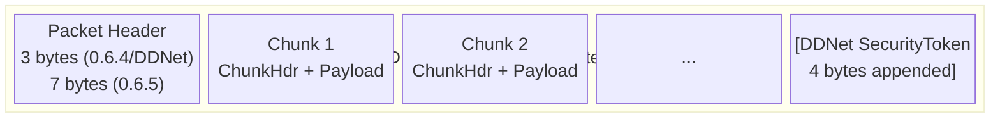
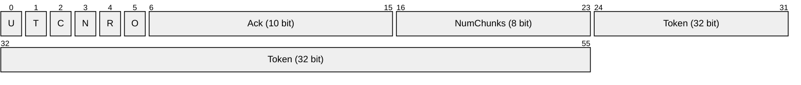
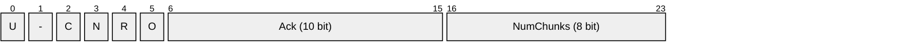
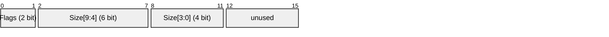
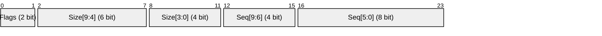
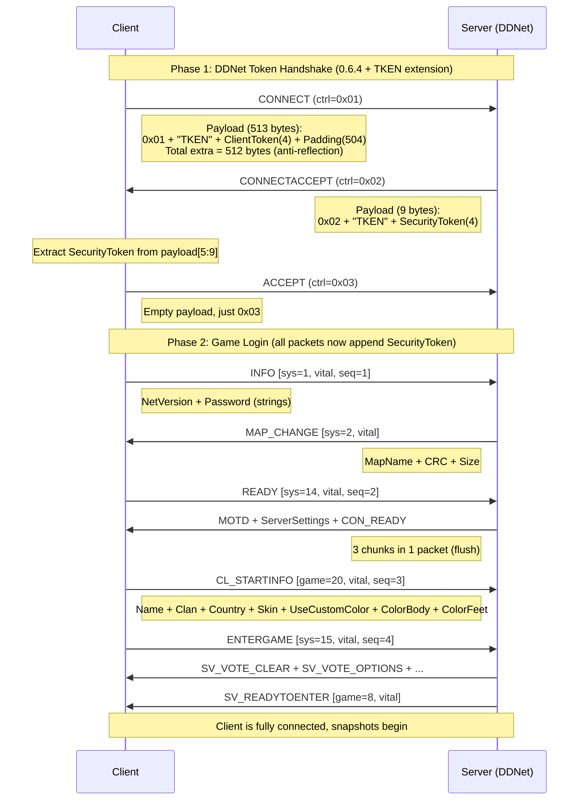
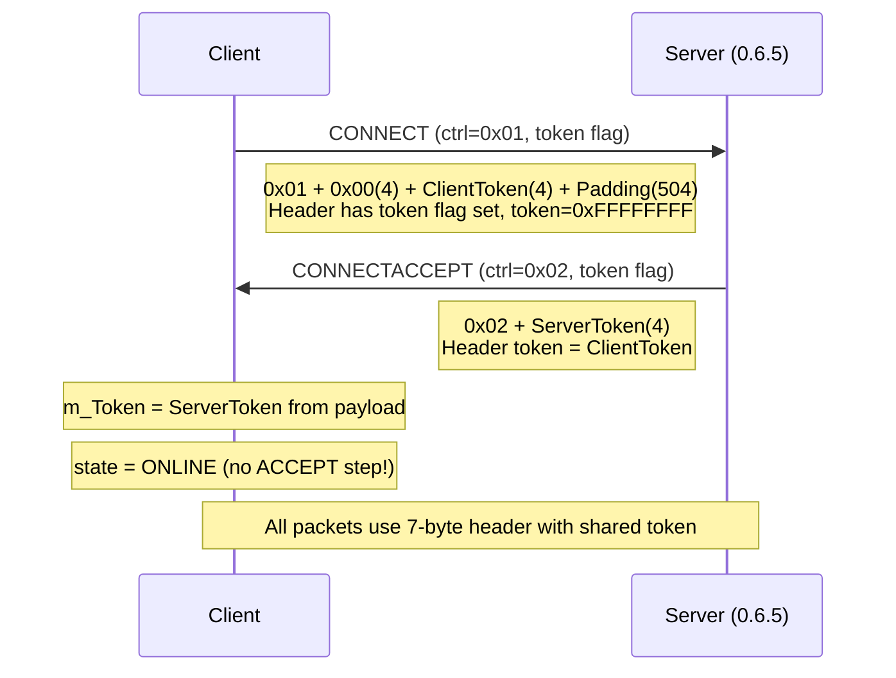
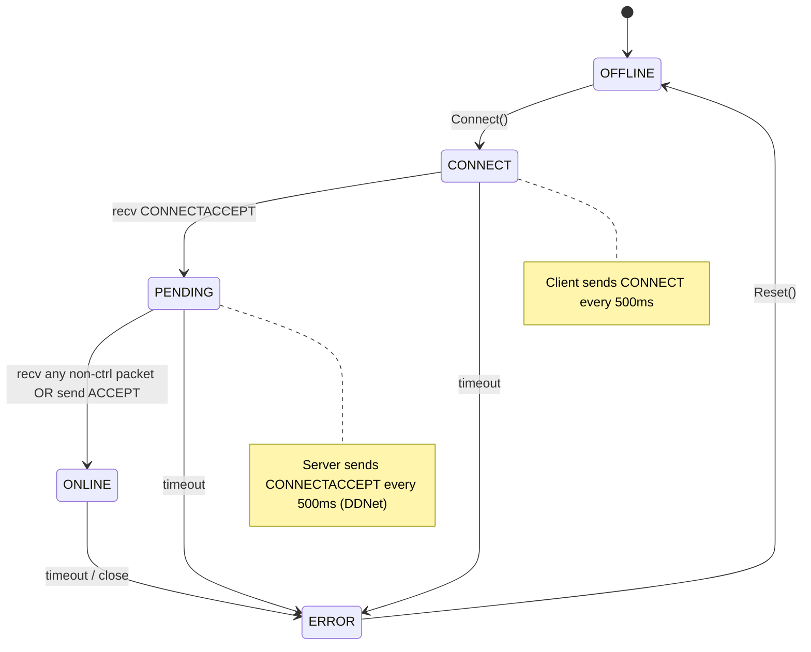

# Teeworlds 0.6 / DDNet Protocol Definition

Use this document for wire protocol details only. For input semantics and replay timing, read [INPUT_AND_REPLAY.md](INPUT_AND_REPLAY.md).

## When To Read

Read this document when you need:

1. packet header and chunk layout,
2. handshake and token rules,
3. message field order or protocol corrections.

## Not For

Do not use this document for:

1. jump or hook semantics,
2. replay controller logic,
3. ghost replay experiment history.

> **Sources:** [chillerdragon docs](https://chillerdragon.github.io/teeworlds-protocol/06/),
> [DDNet network.cpp](https://github.com/ddnet/ddnet/blob/master/src/engine/shared/network.cpp),
> [DDNet network.h](https://github.com/ddnet/ddnet/blob/master/src/engine/shared/network.h),
> [DDNet network_conn.cpp](https://github.com/ddnet/ddnet/blob/master/src/engine/shared/network_conn.cpp),
> [teeworlds-go/protocol](https://github.com/teeworlds-go/protocol)

---

## 1. Packet Structure Overview



- **Control packets**: Header + 1 control message (no chunk headers, NumChunks=0, never compressed)
- **Game/System packets**: Header + N chunks (each with chunk header), may be huffman compressed
- **DDNet token**: Appended **after** all chunk data (not in header)

---

## 2. Packet Header

### 2.1 Vanilla 0.6.5 Header (7 bytes, with token flag)



### 2.2 DDNet / 0.6.4 Header (3 bytes, no header token)



### 2.3 Flag Bits (byte 0, bits 1-5, MSB→LSB)

| Bit | 0.6.4/DDNet | 0.6.5 | Name | Description |
|-----|-------------|-------|------|-------------|
| 5 (MSB) | O | O | **Compression** | Payload is huffman compressed |
| 4 | R | R | **Resend** | Requesting peer to resend |
| 3 | N | N | **Connless** | Connectionless packet |
| 2 | C | C | **Control** | Control packet |
| 1 | - | T | **Token** | 0.6.5 only: 4-byte token follows header |
| 0 | U | U | **Unused** | DDNet uses this for 0.7 detection (Sixup) |

**Source (DDNet network.h):**
```c
NET_PACKETFLAG_UNUSED      = 1 << 0,  // bit 0
NET_PACKETFLAG_TOKEN       = 1 << 1,  // bit 1 (0.6.5 only, not used by DDNet)
NET_PACKETFLAG_CONTROL     = 1 << 2,  // bit 2
NET_PACKETFLAG_CONNLESS    = 1 << 3,  // bit 3
NET_PACKETFLAG_RESEND      = 1 << 4,  // bit 4
NET_PACKETFLAG_COMPRESSION = 1 << 5,  // bit 5
```

**Wire format (DDNet network.cpp SendPacket):**
```c
aBuffer[0] = ((pPacket->m_Flags << 2) & 0xfc) | ((pPacket->m_Ack >> 8) & 0x3);
aBuffer[1] = pPacket->m_Ack & 0xff;
aBuffer[2] = pPacket->m_NumChunks;
```

### 2.4 DDNet Security Token (TKEN Extension)

DDNet is **0.6.4-based** — it does **not** use the 0.6.5 header token flag.
Instead, DDNet appends a 4-byte security token to the **end** of packet payload data.

**Source (DDNet network.cpp SendPacket):**
```c
// DDNet appends security token AFTER payload (before compression)
else if(SecurityToken != NET_SECURITY_TOKEN_UNSUPPORTED)
{
    WriteSecurityToken(pPacket->m_aChunkData + pPacket->m_DataSize, SecurityToken);
    pPacket->m_DataSize += sizeof(SecurityToken);
}
```

**Stripping on receive (DDNet network_conn.cpp Feed):**
```c
if(m_SecurityToken != NET_SECURITY_TOKEN_UNKNOWN && m_SecurityToken != NET_SECURITY_TOKEN_UNSUPPORTED)
{
    pPacket->m_DataSize -= sizeof(m_SecurityToken);
    // verify token at pPacket->m_aChunkData[pPacket->m_DataSize]
}
```

---

## 3. Chunk Header (0.6, Split=4)

Each game/system message within a packet has its own chunk header.

### 3.1 Non-vital (2 bytes)



### 3.2 Vital (3 bytes)



**Flags:** bit 0 = Vital (1), bit 1 = Resend (2)

**Total Size:** 10 bits → max chunk payload = 1023 bytes
**Sequence:** 10 bits → wraps at 1024 (`NET_MAX_SEQUENCE`)

**Source (DDNet network.cpp CNetChunkHeader::Pack, Split=4):**
```c
pData[0] = ((m_Flags & 3) << 6) | ((m_Size >> Split) & 0x3f);
pData[1] = (m_Size & ((1 << Split) - 1));        // low 4 bits of size
if(m_Flags & NET_CHUNKFLAG_VITAL)
{
    pData[1] |= (m_Sequence >> 2) & (~((1 << Split) - 1));  // high bits of seq
    pData[2] = m_Sequence & 0xff;                            // low 8 bits of seq
    return pData + 3;
}
return pData + 2;
```

---

## 4. Message ID Encoding (Varint)

The first varint in each chunk payload encodes:
```
packed_id = (msg_id << 1) | system_flag
```
- `system_flag = 1` → system message
- `system_flag = 0` → game message

**Source (teeworlds-go/protocol packer.go):**
```go
func UnpackMsgAndSys(data []byte) (msgId int, system bool) {
    msg := UnpackInt(data)
    sys := msg&1 != 0
    msg >>= 1
    return msg, sys
}
```

---

## 5. Varint Encoding

Format: `ESDDDDDD EDDDDDDD EDDDDDDD EDDDDDDD EDDDDDDD`

| Bit | Meaning |
|-----|---------|
| E (bit 7) | Extension: 1 = more bytes follow, 0 = last byte |
| S (bit 6, first byte only) | Sign: 1 = negative, 0 = positive |
| D | Data bits |

- First byte: 6 data bits (values 0-63 fit in 1 byte)
- Subsequent bytes: 7 data bits each
- Byte order: **little endian** (least significant bits first)
- Negative: one's complement (XOR with -1)

**Source (DDNet compression.cpp):**
```
Format: ESDDDDDD EDDDDDDD EDD... Extended, Data, Sign
```

---

## 6. DDNet Connection Handshake



### 6.1 Vanilla 0.6.5 Handshake (for comparison)



**Key difference:** DDNet uses 3-byte headers + appended TKEN token; vanilla 0.6.5 uses 7-byte headers with token in header. DDNet has an extra ACCEPT step.

---

## 7. Control Messages (0.6)

| ID | Name | Sender | Payload |
|----|------|--------|---------|
| 0x00 | KEEPALIVE | Both | (none) |
| 0x01 | CONNECT | Client | `"TKEN"(4) + ClientToken(4) + Padding(504)` = 512 bytes |
| 0x02 | CONNECTACCEPT | Server | `"TKEN"(4) + SecurityToken(4)` = 8 bytes |
| 0x03 | ACCEPT | Client (DDNet) | (none) — removed in vanilla 0.6.5 |
| 0x04 | CLOSE | Both | Optional null-terminated reason string |

**Source (DDNet network.h):**
```c
NET_CTRLMSG_KEEPALIVE     = 0,
NET_CTRLMSG_CONNECT       = 1,
NET_CTRLMSG_CONNECTACCEPT = 2,
NET_CTRLMSG_ACCEPT        = 3,
NET_CTRLMSG_CLOSE         = 4,
```

**Control packet rules:**
- Always `NumChunks = 0`
- Never compressed (no huffman)
- Payload = `[ctrl_msg_id(1 byte)] + [extra_data]`

---

## 8. System Messages (0.6)

| ID | Name | Direction | Payload | Notes |
|----|------|-----------|---------|-------|
| 1 | INFO | C→S | `String(version) + String(password)` | First msg after handshake |
| 2 | MAP_CHANGE | S→C | `String(map) + Int(crc) + Int(size)` | |
| 3 | MAP_DATA | S→C | `Int(last) + Int(crc) + Int(chunk) + Int(chunkSize) + Raw(data)` | |
| 4 | CON_READY | S→C | (none) | Triggers OnConnected() |
| 5 | SNAP | S→C | `Int(tick) + Int(deltaTick) + Int(numParts) + Int(part) + Int(crc) + Int(partSize) + Raw(data)` | Multi-part snapshot |
| 6 | SNAPEMPTY | S→C | `Int(tick) + Int(deltaTick)` | |
| 7 | SNAPSINGLE | S→C | `Int(tick) + Int(deltaTick) + Int(crc) + Int(partSize) + Raw(data)` | Single-part snapshot |
| 8 | SNAPSMALL | S→C | ??? | Undocumented |
| 9 | INPUTTIMING | S→C | `Int(intendedTick) + Int(timeLeft)` | |
| 10 | RCON_AUTH_STATUS | S→C | `Int(authed) + Int(cmdList)` | |
| 11 | RCON_LINE | S→C | `String(line)` | |
| 12 | AUTH_CHALLENGE | - | (unused) | |
| 13 | AUTH_RESULT | - | (unused) | |
| 14 | READY | C→S | (none) | Client has map |
| 15 | ENTERGAME | C→S | (none) | Client wants to play |
| 16 | INPUT | C→S | `Int(ackTick) + Int(predTick) + Int(size) + [PlayerInput fields]` | |
| 17 | RCON_CMD | C→S | `String(command)` | |
| 18 | RCON_AUTH | C→S | `String(name) + String(password) + Int(sendRconCmds)` | |
| 19 | REQUEST_MAP_DATA | C→S | `Int(chunk)` | |
| 20 | AUTH_START | - | (unused) | |
| 21 | AUTH_RESPONSE | - | (unused) | |
| 22 | PING | Both | (none) | |
| 23 | PING_REPLY | Both | (none) | |
| 24 | ERROR | - | (unused) | |
| 25 | RCON_CMD_ADD | S→C | `String(name) + String(help) + String(params)` | |
| 26 | RCON_CMD_REM | S→C | `String(name)` | |

**Source (chillerdragon):** https://chillerdragon.github.io/teeworlds-protocol/06/system_messages.html

---

## 9. Game Messages (0.6)

| ID | Name | Direction | Payload |
|----|------|-----------|---------|
| 1 | SV_MOTD | S→C | `String(message)` |
| 2 | SV_BROADCAST | S→C | `String(message)` |
| 3 | SV_CHAT | S→C | `Int(team) + Int(clientID) + String(message)` |
| 4 | SV_KILLMSG | S→C | `Int(killer) + Int(victim) + Int(weapon) + Int(modeSpecial)` |
| 5 | SV_SOUNDGLOBAL | S→C | `Int(soundID)` |
| 6 | SV_TUNEPARAMS | S→C | `Int × 32 (tune parameters)` |
| 7 | SV_EXTRAPROJECTILE | S→C | `Int(num) + [Projectile structs]` (removed 2015) |
| 8 | SV_READYTOENTER | S→C | (none) |
| 9 | SV_WEAPONPICKUP | S→C | `Int(weapon)` |
| 10 | SV_EMOTICON | S→C | `Int(clientID) + Int(emoticon)` |
| 11 | SV_VOTECLEAROPTIONS | S→C | (none) |
| 12 | SV_VOTEOPTIONLISTADD | S→C | `Int(numOptions) + String × 15` |
| 13 | SV_VOTEOPTIONADD | S→C | `String(description)` |
| 14 | SV_VOTEOPTIONREMOVE | S→C | `String(description)` |
| 15 | SV_VOTESET | S→C | `Int(timeout) + String(desc) + String(reason)` |
| 16 | SV_VOTESTATUS | S→C | `Int(yes) + Int(no) + Int(pass) + Int(total)` |
| 17 | CL_SAY | C→S | `Int(team) + String(message)` |
| 18 | CL_SETTEAM | C→S | `Int(team)` |
| 19 | CL_SETSPECTATORMODE | C→S | `Int(spectatorID)` |
| 20 | CL_STARTINFO | C→S | `String(name) + String(clan) + Int(country) + String(skin) + Int(useCustomColor) + Int(colorBody) + Int(colorFeet)` |
| 21 | CL_CHANGEINFO | C→S | Same as CL_STARTINFO |
| 22 | CL_KILL | C→S | (none) |
| 23 | CL_EMOTICON | C→S | `Int(emoticon)` |
| 24 | CL_VOTE | C→S | `Int(vote)` |
| 25 | CL_CALLVOTE | C→S | `String(type) + String(value) + String(reason)` |

**Source (chillerdragon):** https://chillerdragon.github.io/teeworlds-protocol/06/game_messages.html

---

## 10. Snap Object Types (0.6)

| ID | Name | Fields |
|----|------|--------|
| 1 | PlayerInput | Direction, TargetX, TargetY, Jump, Fire, Hook, PlayerFlags, WantedWeapon, NextWeapon, PrevWeapon |
| 2 | Projectile | X, Y, VelX, VelY, Type, StartTick |
| 3 | Laser | X, Y, FromX, FromY, StartTick |
| 4 | Pickup | X, Y, Type, Subtype |
| 5 | Flag | X, Y, Team |
| 6 | GameInfo | GameFlags, GameStateFlags, RoundStartTick, WarmupTimer, ScoreLimit, TimeLimit, RoundNum, RoundCurrent |
| 7 | GameData | TeamscoreRed, TeamscoreBlue, FlagCarrierRed, FlagCarrierBlue |
| 8 | CharacterCore | Tick, X, Y, VelX, VelY, Angle, Direction, Jumped, HookedPlayer, HookState, HookTick, HookX, HookY, HookDx, HookDy |
| 9 | Character | CharacterCore + Health, Armor, AmmoCount, Weapon, Emote, AttackTick |
| 10 | PlayerInfo | Local, ClientID, Team, Score, Latency |
| 11 | ClientInfo | Name(4), Clan(3), Country, Skin(6), UseCustomColor, ColorBody, ColorFeet |
| 12 | SpectatorInfo | SpectatorID, X, Y |

---

## 11. Connection States (DDNet)



**Source (DDNet network.h CNetConnection::EState):**
```c
enum class EState { OFFLINE, WANT_TOKEN, CONNECT, PENDING, ONLINE, ERROR };
```

---

## 12. DDNet Extended Messages (UUID-based)

DDNet uses UUID-based extended messages for features added after the vanilla 0.6 protocol.
These use `NETMSG_EX` (msg ID = 0) as the message ID, followed by a 16-byte UUID.

### Wire Format

```
varint(1)       ← PackMsgID(0, system=true) = (0<<1)|1 = 1
[16 bytes UUID] ← deterministic UUID v3 computed from message name
[payload...]    ← message-specific fields
```

### UUID Computation

UUIDs are computed using UUID v3 (MD5-based, RFC 4122):
```
MD5(TEEWORLDS_NAMESPACE || name_without_NUL)
```
Where `TEEWORLDS_NAMESPACE = e05ddaaa-c4e6-4cfb-b642-5d48e80c0029`.
After MD5: set version=3 (byte[6]), variant=1 (byte[8]).

### Known Extended Messages

| Name | UUID Name | Direction | Payload |
|------|-----------|-----------|---------|
| WHATIS | `what-is@ddnet.tw` | Both | `UUID(16 bytes)` — asks peer to identify a UUID |
| ITIS | `it-is@ddnet.tw` | Both | `UUID(16 bytes) + String(name)` — response to WHATIS |
| IDONTKNOW | `i-dont-know@ddnet.tw` | Both | `UUID(16 bytes)` — unknown UUID response |
| RCONTYPE | `rcon-type@ddnet.tw` | S→C | `Int(usernameRequired)` |
| MAP_DETAILS | `map-details@ddnet.tw` | S→C | `String(map) + Raw(sha256,32) + Int(crc) + Int(size) + String(url)` |
| CAPABILITIES | `capabilities@ddnet.tw` | S→C | `Int(version) + Int(flags)` |
| **CLIENTVER** | `clientver@ddnet.tw` | **C→S** | `UUID(connUUID,16) + Int(ddnetVersion) + String(versionStr)` |
| PINGEX | `ping@ddnet.tw` | Both | `UUID(16 bytes)` |
| PONGEX | `pong@ddnet.tw` | Both | `UUID(16 bytes)` |
| REDIRECT | `redirect@ddnet.org` | S→C | `Int(port)` |
| RECONNECT | `reconnect@ddnet.org` | S→C | (none) |

### CLIENTVER Details

Sent by the client **before** `NETMSG_INFO` during login. Without this, the DDNet
server treats the client as vanilla 0.6 (no DDNet features, no capabilities).

```
[varint(1)]                  ← NETMSG_EX + sys flag
[16 bytes]                   ← UUID of "clientver@ddnet.tw" (8c001304-8461-3e47-8787-f672b3835bd4)
[16 bytes]                   ← random connection UUID (v4, unique per connection)
[varint(DDNetVersion)]       ← e.g. 19070 for DDNet 19.0.7
[null-terminated string]     ← e.g. "DDNet 19.0.7 (tw-protocol/go)"
```

### CAPABILITIES Flags

| Flag | Bit | Meaning |
|------|-----|---------|
| DDNET | 0 | Server is DDNet |
| CHATTIMEOUTCODE | 1 | Timeout code support |
| ANYPLAYERFLAG | 2 | Arbitrary player flags allowed |
| PINGEX | 3 | Extended ping (UUID-based) |
| ALLOWDUMMY | 4 | Dummy connections allowed |
| SYNCWEAPONINPUT | 5 | Synchronized weapon input |

**Source:** DDNet `protocol_ex_msgs.h`, `protocol_ex.h`, `uuid_manager.cpp`

---

## 13. Huffman Compression

- Only non-control packet payloads can be compressed
- Compression flag is set in packet header if payload is compressed
- Uses the official TW frequency table
- Security token is appended **before** compression (i.e., it gets compressed too)

**Source (DDNet network.cpp SendPacket):**
```c
// Security token appended to m_aChunkData BEFORE compression attempt
// Then compression is tried:
if((pPacket->m_Flags & NET_PACKETFLAG_CONTROL) == 0)
{
    CompressedSize = ms_Huffman.Compress(pPacket->m_aChunkData,
        pPacket->m_DataSize, &aBuffer[HeaderSize], ...);
}
```

---

## 14. Constants Reference

| Constant | Value | Source |
|----------|-------|--------|
| `NET_MAX_PACKETSIZE` | 1400 | network.h |
| `NET_MAX_PAYLOAD` | 1394 (1400-6) | network.h |
| `NET_PACKETHEADERSIZE` | 3 | network.h |
| `NET_MAX_SEQUENCE` | 1024 (10 bit) | network.h |
| `NET_MAX_CHUNK_SIZE` | 1023 (10 bit) | network.h |
| `NET_MAX_PACKET_CHUNKS` | 255 (8 bit) | network.h |
| `NET_TOKENREQUEST_DATASIZE` | 512 | network.h |
| `NET_SECURITY_TOKEN_UNKNOWN` | -1 | network.h |
| `NET_SECURITY_TOKEN_UNSUPPORTED` | 0 | network.h |
| `SECURITY_TOKEN_MAGIC` | `{'T','K','E','N'}` | network.cpp |
| `NET_VERSION` (0.6) | `"0.6 626fce9a778df4d4"` | protocol.h |
| `NET_VERSION` (0.7) | `"0.7 802f1be60a05665f"` | protocol.h |

---

## Revision Log

| Date | Change | Source |
|------|--------|--------|
| 2026-04-05 | Initial creation from chillerdragon docs + DDNet source | chillerdragon 0.6 docs, DDNet network.h/cpp/conn.cpp |
| 2026-04-05 | Confirmed DDNet is 0.6.4-based, NOT 0.6.5 — no header token flag | DDNet network_conn.cpp `SendConnect()` sends "TKEN" as payload extra, not header token |
| 2026-04-05 | Confirmed TKEN magic in CONNECT at `payload[1:5]`, client token at `payload[5:9]` | DDNet network_conn.cpp `Feed()` + chillerdragon ctrl_messages |
| 2026-04-05 | Confirmed security token appended AFTER payload, BEFORE compression | DDNet network.cpp `SendPacket()` |
| 2026-04-05 | Confirmed chunk header Split=4 for 0.6, Split=6 for 0.7 | DDNet network.cpp `CPacketChunkUnpacker::UnpackNextChunk()` |
| 2026-04-05 | Confirmed ACCEPT (ctrl=3) exists in DDNet but removed from vanilla 0.6.5 | DDNet network_conn.cpp + chillerdragon ctrl_messages |
| 2026-04-05 | Confirmed DDNet flag byte compatible with 0.6: `((flags << 2) & 0xfc) \| (ack >> 8) & 0x3` | DDNet network.cpp `SendPacket()` |
| 2026-04-05 | Verified NET_PACKETFLAG bit positions match between DDNet source and chillerdragon | DDNet network.h enum vs chillerdragon packet_layout |
| 2026-04-07 | Fixed snapshot delta format: updated items use separate type+id varints (not packed key); size field only present for unknown/extended item types | DDNet snapshot.cpp `CreateDelta()`+`CompressDelta()`+`UnpackDelta()` |
| 2026-04-07 | Added DDNet extended messages section (§12): CLIENTVER, CAPABILITIES, UUID computation | DDNet protocol_ex_msgs.h, uuid_manager.cpp, client.cpp `SendInfo()` |
| 2026-04-07 | Documented INPUTTIMING (msg 9) role in prediction time adjustment | DDNet client.cpp `ProcessServerPacket()` NETMSG_INPUTTIMING handler |
